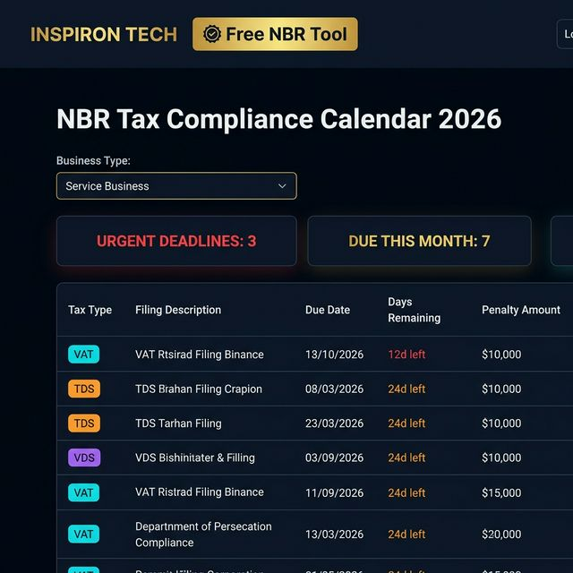

<div align="center">

# COMMUNITY-TOOLS

**Free, Claude-powered tools for Bangladeshi SMEs and underserved citizens**

Built by [INSPIRON TECH](https://inspiron.tech) — Official Manager.io Partner, Bangladesh

[](https://opensource.org/licenses/MIT)
[](https://tools.inspiron.tech)
[](https://anthropic.com)

</div>

---

## 🛠️ Live Tools

| # | Tool | What It Does | AI | Status |
|---|---|---|---|---|
| 1 | **[TAX-CALENDAR-BD](./TAX-CALENDAR-BD/)** | NBR compliance calendar — VAT, Income Tax, TDS, VDS deadlines + Manager.io CSV export | Claude Haiku Q&A | ✅ [Live](https://tools.inspiron.tech) |

### TAX-CALENDAR-BD

A free, self-contained web app for Bangladeshi SMEs:

- 📅 Upcoming VAT (Mushak-9.1), Income Tax, TDS (Form 108), VDS, and Advance Tax deadlines
- 💬 **Claude-powered Q&A** — ask any NBR tax question in plain English or Bengali
- ⚠️ Penalty calculator for late filing
- 📊 One-click CSV export for Manager.io Journal Entries
- 📱 Mobile-first, bilingual (English/Bengali), no login required

**Business types supported:** Trading · Manufacturing · Service · Sole Proprietor · Limited Company · Import/Export



---

## 🗺️ Roadmap

| # | Tool | Description | AI Integration | Status |
|---|---|---|---|---|
| 2 | **MUSHAK-FORM-GENERATOR** | Auto-generate Mushak 6.3, 9.1, 16, 17, 18, 19 from transaction data | Claude | 🔵 Planned |
| 3 | **TIN-VALIDATOR-BD** | Validate Bangladesh TIN numbers against NBR format rules | — | 🔵 Planned |
| 4 | **INVOICE-COMPLIANCE-CHECK** | Scan invoices for missing VAT fields, BIN numbers, Mushak references | Claude | 🔵 Planned |
| 5 | **COA-TEMPLATE-BD** | Ready-to-import Chart of Accounts templates for BD industries | — | 🔵 Planned |
| 6 | **AIT-CALCULATOR** | Advance Income Tax calculator with source-wise rate lookup | — | 🔵 Planned |
| 7 | **VDS-RATE-FINDER** | Look up VDS rates by service category (SRO-based) | Claude | 🔵 Planned |
| 8 | **SALARY-SHEET-BD** | Payroll calculator with BD income tax slabs and provident fund | — | 🔵 Planned |
| 9 | **TRADE-LICENSE-RENEWAL** | Track trade license, IRC, ERC, BIDA renewal deadlines | — | 🔵 Planned |
| 10 | **NBR-SRO-SEARCH** | Search and explain NBR Statutory Regulatory Orders in plain language | Claude | 🔵 Planned |

---

## 🤖 Claude Integration

This project uses [Anthropic Claude](https://anthropic.com) as the AI engine for:

- **Tax Q&A** — Natural language questions about Bangladesh NBR rules, deadlines, and penalties
- **Form Guidance** — Explains which Mushak forms apply to your business type
- **Compliance Intelligence** — Interprets SROs and regulatory updates

> Built by a solo architect using Claude as the core engineering engine across every tool.
> [Read more about INSPIRON TECH's Claude-powered practice →](https://inspiron.tech)

---

## 🏗️ Architecture

```
COMMUNITY-TOOLS/
├── TAX-CALENDAR-BD/          ← Live at tools.inspiron.tech
│   ├── index.html            ← Self-contained SPA (HTML + JS + CSS)
│   ├── api/                  ← Vercel serverless — Claude Haiku proxy
│   └── vercel.json           ← Deployment config
├── [FUTURE-TOOL]/
│   └── ...
├── CONTRIBUTING.md
├── CHANGELOG.md
└── LICENSE (MIT)
```

Each tool is a **self-contained directory** — one HTML file, one optional API route. No build step. No framework. Just ship.

---

## 🤝 Why Open Source?

We believe every Bangladeshi SME should have access to free, accurate NBR compliance tooling — regardless of size or budget.

The expert **implementation** layer — Manager.io system builds, Chart of Accounts architecture, full compliance automation — is where [INSPIRON TECH](https://inspiron.tech) delivers paid advisory services.

**Open tools build trust. Trust builds clients.**

---

## 📬 Contact

<div align="center">

[](https://inspiron.tech)
[](mailto:hello@inspiron.tech)
[](https://wa.me/8801719300849)
[](https://manager.io/advisors)

**MD ABU HASAN** · Founder & Chief Architect, INSPIRON TECH
*"I do not install software. I architect logic."*

</div>

---

## License

MIT — copy, fork, build upon freely. Attribution appreciated.
